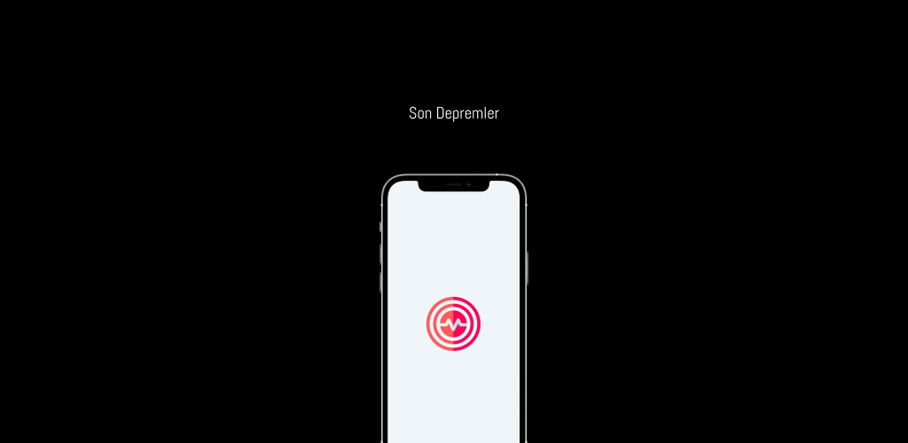
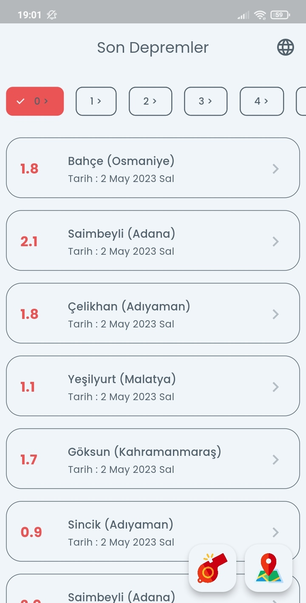
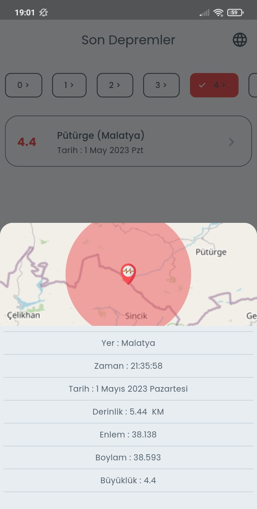
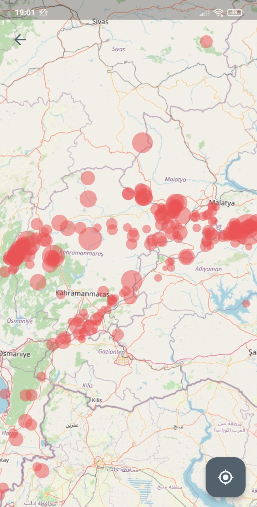
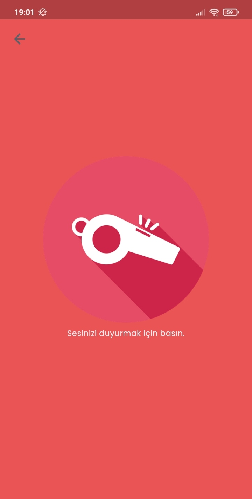

# Son Depremler

## Play Store

## Tech Stack
- MVVM Architecture
- State Management : [Mobx](https://pub.dev/packages/mobx)
- Network : [Vexana](https://pub.dev/packages/vexana)
- Localization : [Easy Localization](https://pub.dev/packages/easy_localization)
- Navigation : [Go Router](https://pub.dev/packages/go_router)
- Maps : [Flutter Map](https://pub.dev/packages/flutter_map)
- APİ : [AFAD](https://deprem.afad.gov.tr/event-service)

## Preview

<table>
  <tr align="center">
    <td colspan="4">Preview</td>
</tr>
  <tr align="center">
    <td colspan="4"></td>
  </tr>
  <tr align="center">
    <td colspan="4">Home Screen / Detail Screen</td>
  </tr>
  <tr align="center">
    <td colspan="2"></td>
    <td colspan="2"></td>
  </tr>
  <tr align="center">
    <td colspan="4">Map Screen / Whistle Screen</td>
  </tr>
  <tr align="center">
    <td colspan="2"></td>
    <td colspan="2"></td>
  </tr>
 </table>

